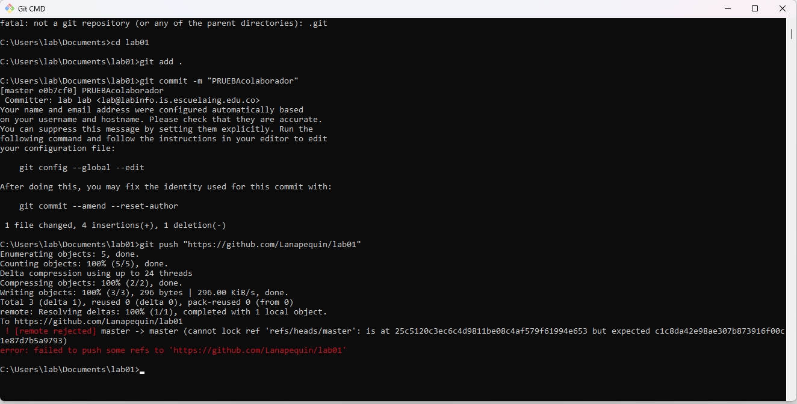

# Laboratorio 1
## Respuestas

### Investigacion PARTE I (Trabajo Individual)

#### ¿Para que es y como se usa git add?
Se usa para agregar un cambio realizado, con el fin de posteriormente poder hacer commit; este comando se puede usar desde terminal, pero desde la raiz del directorio.
#### ¿Para que es y como se usa git commit -m “mensaje”?
Se usa para guardar en la historia los cambios realizados que anteriormente ya fueron agregados con el git add; este comando se puede usar desde terminal.

### Investigacion PARTE II (Trabajo en parejas)
PRUEBA DE CAMBIOS AL MISMO TIEMPO CON MI COMPAÑERO

#### Punto 1
Owner Laura Natalia Perilla, Collaborator Santiago Amaya Zapata

#### Punto 6

## Integrantes
Santiago Amaya Zapata

Laura Natalia Perilla Quintero
